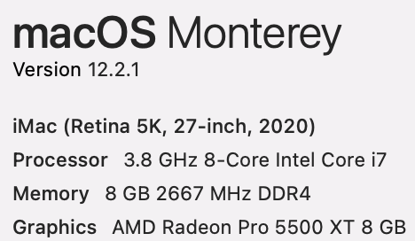
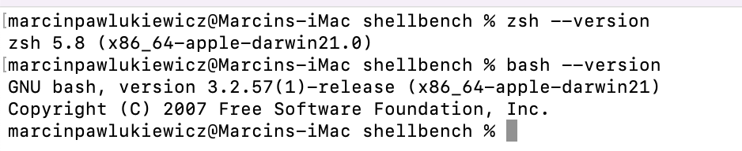
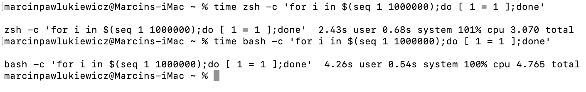
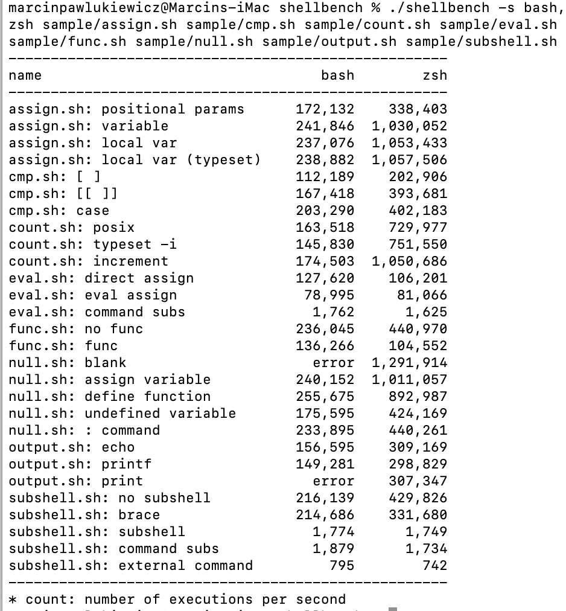

# Performance

To check the performance of both shells I used two different methods I found online. Firstly, to have a clear comparison, those are my hardware information and bash and zsh version I used in those tests:  
    
  

First method is very easy in use, a simple check how much time does it take for a shell program to complete a simple task. In this case the task is to run a loop for a million times. Those are the results:

We can conclude that in that case, zsh outperform bash system. The total running time for zsh was 2.43s while for bash it was 4.26s and that is a huge difference.

The second method I found is only a little bit more complicated but provides more tests and soever more data. Created by ShellSpec, a benchmark utility for POSIX script comparison called ShellBench. I ran all possible test available in the given sample.

Error occurs for unavailable commands/ functions in the specific shell. Besides that we can see that zsh is faster for almost every test case. Exception are eval.sh direct assign, eval.sh command subs, subshell.sh sub shell, sub shell.sh command subs and sub shell.sh external command. But notice that the difference in number of executions per seconds is not that big. For instance, zsh overran bash over four times in many cases. 

If you are interested to test it out on your own hardware, here is the link: https://github.com/shellspec/shellbench 
All you need to do is to clone the repository and run the command.

Additionally, if you are interested in the programs both shell ran, look at the above link, are the source code is available there and this way you can compare the tasks and differences of outcome.

Summarizing, we see that overall, zsh performs much more efficient than bash in almost every category. There are few programs where you can put bash into consideration. Also, in low lines code you will not notice a difference so you can easily use both shells. 

Sources:
https://github.com/shellspec/shellbench
https://towardsdatascience.com/comparing-sh-bash-ksh-and-zsh-speed-82a72bbc20ed
https://dev.to/jasmin/a-brief-difference-between-zsh-and-bash-5ebp
