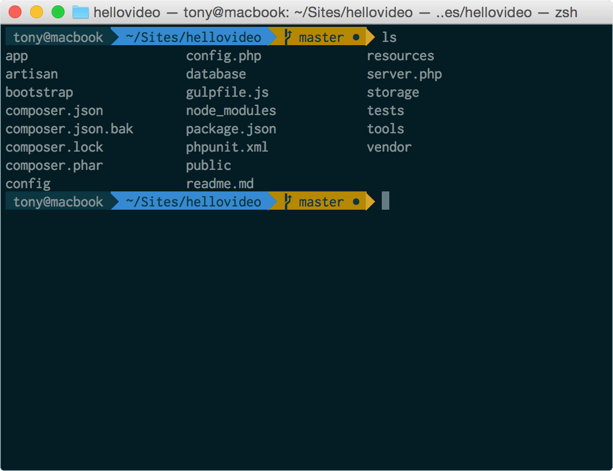
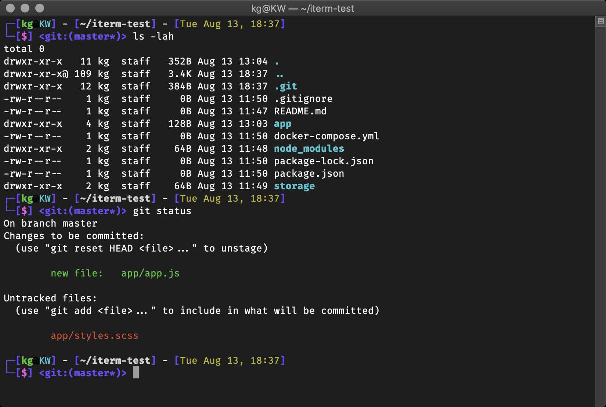

# Prompt
While bash allows you only to either customize colors in the terminal or the name of the prompt (name displayed on the left in every line), this is the bare minimum zsh can offer.

Look at one of the themes below for zsh:
 

Isn’t it impressive? 

We can get plenty of themes available on the internet. To get started we simply need Oh My Zsh, which can be found here: https://github.com/ohmyzsh/ohmyzsh
Then we can search for our desired theme here: https://github.com/ohmyzsh/ohmyzsh/wiki/themes

Here is the second example, this is a theme called xiong-chiamiov-plus:

 

Notice how neatly the theme cooperates with the git. That is what makes this shell really useful in collaborative projects on git. We can see all the branches and connections very neatly. This cut down the risk of making mistakes and allows us to focus more on the actual work.

Lastly, at the top of all of these themes, Oh My Zsh contains 250 plugins that can be added to the shell and make it even more customizable.

One of the most popular plugins is a plugin called thefuck that corrects errors in the previous console command. Take a look (also take a closer look at this customized terminal):

 

https://github.com/nvbn/thefuck 

https://github.com/ohmyzsh/ohmyzsh/wiki/themes
